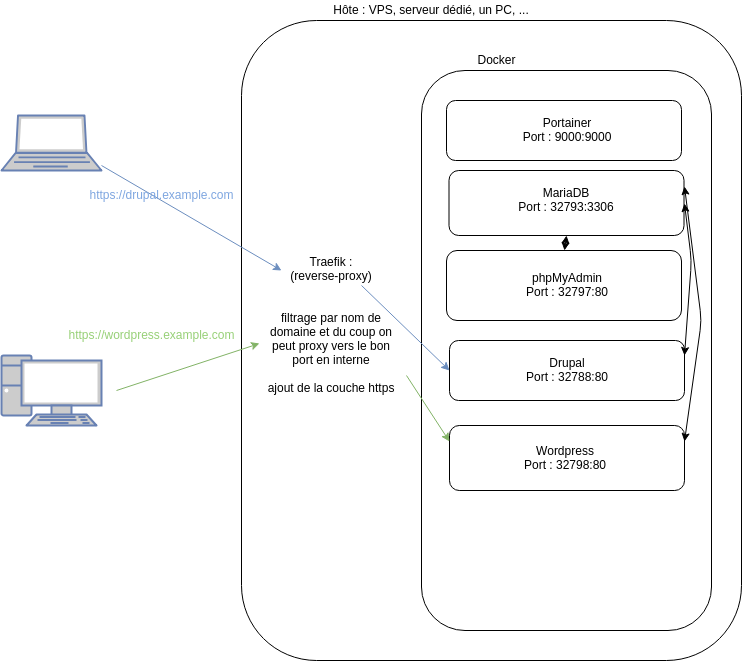
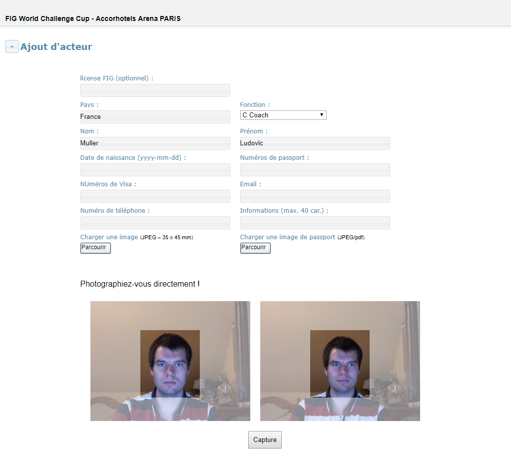

# Travail réalisé

Dans cette partie, je vais détailler les différents travaux que j’ai pu réaliser durant mes trois mois de stage au sein de l’agence. Je commencerai par présenter l’extranet, le projet sur lequel mon stage s’est concentré en priorité, puis ce que j’ai pu faire sur un projet de commerce en ligne. J'ai également pu participer à la réactualisation d’une partie du site de gestion des accréditations de la fédération française de gymnastique ainsi que diverses autres tâches.

## Extranet

### Présentation

Jusqu’à présent, les chefs de projets utilisaient majoritairement des tableurs pour avoir une vue d’ensemble, que ce soit sur les projets ou bien sur le personnel. Le fait d’avoir un outil qui se charge de s’occuper de ces opérations permet d’assurer un meilleur suivi, puisque tout le monde est en mesure de lire et comprendre les mêmes informations. 

Concernant la gestion de projets, le fait de récupérer les commandes, les factures et les abonnements associés, les clients et leurs contacts depuis Sellsy, le logiciel de gestion d’entreprise qu’ils utilisent, permet de se rendre compte d’un coup d’œil ce qui a été payé, les paiements en attente, et ce qu’il reste encore à facturer conformément aux commandes, tout en pouvant consulter l’état du projet, les prochaines tâches à effectuer, et ainsi que tout autre données associés au projet. Cette centralisation de l’information permet d’assurer un suivi de meilleure qualité de la part des chefs de projets.

De surcroît, le fait d’avoir un outil complet permet également de faciliter le travail pour le gérant, car la génération de documents pour le comptable peut désormais se faire de manière automatique, en fonction des congés et des notes de frais saisies par chacun des employés, qui peuvent être ou non validées d’un simple clic de souris.

### Première version

#### Technologies

Pour ce projet, on m’a laissé beaucoup de libertés concernant les choix d’implémentation et les technologies à utiliser. La seule contrainte était d’utiliser le *framework* PHP qui s’appelle CodeIgniter, celui qu’ils utilisent le plus et que j’ai pu découvrir avec ce projet. Un *framework* est une structure de base, qui assure une certaine standardisation et interopérabilité du code entre différents projets, et offre en général une bonne base de travail pour débuter un projet rapidement ; on peut donc se concentrer réellement sur le code propre à l’application. Puisqu'il s'agit d'un produit interne, il ne m’a pas été demandé de faire un très grand travail d’esthétisme, mais simplement de faire quelque chose de fonctionnel et de simple à utiliser. J’ai donc utilisé Bootstrap, qui est un *framework* CSS, ainsi que jQuery, qui est une librairie JavaScript, afin de développer rapidement quelque chose de visuellement simple mais parfaitement fonctionnel. Concernant le stockage des données, j’ai choisi d’utiliser MySQL, car il s’agit d’un système de gestion de base de données répandu et très simple à utiliser avec CodeIgniter. Le projet a été versionné avec `git` et le dépôt est hébergé sur Bitbucket. 

#### Récupération de données depuis Sellsy, un service tiers

L’objectif principal de ce projet étant de centraliser les différentes informations, j’ai dû faire en sorte de récupérer une partie des informations depuis Sellsy, le logiciel de gestion d’entreprise qu’utilise Adpiso, en effectuant des requêtes sur leur API. Une API, de l’anglais *Application Programming Interface*, permet à un logiciel d'offrir à d’autres applications l’accès à des services de manière normalisée, ce qui évite au développeur de comprendre les mécanismes de traitements internes propres au service tiers. Dans le domaine du web les applications offrant des services exposent en général un certain nombre d’URL depuis lesquelles il est possible de récupérer certaines données, mais nécessitent souvent une authentification. Après avoir eu les accès et suite à la lecture de la documentation de l’API de Sellsy, j’ai pu récupérer l’ensemble des clients, qui sont en général des entreprises, leurs contacts associés, les différentes commandes de chacun des clients ainsi que les factures et les abonnements.

#### Fonctionnalités

Tout d’abord, chaque personne de l’agence doit pouvoir avoir un compte personnel. J’ai donc mis en place un système de comptes utilisateur, où l’on peut facilement lister, ajouter, modifier ou supprimer des utilisateurs. J’ai mis en place un système qui envoie un mail à l’utilisateur pour définir un nouveau mot de passe en cas de perte de ce dernier. Chaque personne de l’agence n’ayant pas besoin des mêmes accès, j’ai également mis en place une gestion de rôles et permissions plutôt complète.

L’outil permet également de visualiser l’ensemble des clients de l’agence, en général des entreprises, avec les contacts, les commandes avec ce qu’il reste à facturer, les différentes factures liées aux commandes ou abonnements et leur statut associés à chacun des clients. Ces données sont récupérées depuis Sellsy, le logiciel de gestion d’entreprise utilisé par Adipso, comme j’ai pu le détailler dans le point précédent. Aujourd’hui l’entreprise continue de gérer les différentes commandes et factures depuis Sellsy, mais le fait de pouvoir présenter les données directement sur chacun des clients comme je l’ai fait pour l’extranet, permet d’avoir une vue d’ensemble pratique, complète et parfaitement adaptés aux besoins de l’agence.

Un autre aspect important de cet outil est tout ce qui concerne la gestion de projets. En effet, il est possible de créer, modifier, consulter, supprimer et mettre en favoris des projets. Un projet est défini en partie par le domaine, le client principal et les différentes commandes ; les factures seront quant à elles automatiquement affichées, car elles sont directement liées aux commandes sélectionnées. Il y a aussi la possibilité d'y assigner des utilisateurs, de préciser la prochaine action à effectuer et d'indiquer l’estimation de la date de fin du projet, dans le but de pouvoir afficher les projets qui auraient du retard. Un système de tags avec valeur est par ailleurs à disposition, dans le but de retrouver très rapidement certains types de projets utilisant une technologie particulière. De plus, il est aussi possible d'y ajouter une liste d’URL (pour accéder directement au site, à l’administration, aux maquettes et autres ressources), une liste d’identifiants, avec gestion de la confidentialité, et un ensemble d’interlocuteurs propres au projet, qui peuvent être exportés en fonction de leur type et des tags des projets auxquels ils sont reliés. On peut donc facilement récupérer la liste des personnes à contacter si l’on souhaite par exemple mettre une technologie à jour.
	
Chaque utilisateur possède son propre compte, ce qui permet de gérer finement les différentes permissions. Sue la demande de Jean, j'ai ajouté une partie permettant de simplifier la gestion d’entreprise. En effet, chaque utilisateur peut déposer une demande de congés (congé, maladie ou autre), déposer les pièces justificatives, qui devra être validée par une personne habilitée. Un fonctionnement similaire pour la gestion des notes de frais (frais de transports et autres dépenses) est également en place. Il est également possible de gérer les différents contrats de chaque utilisateur (CDI, CDD, stage, apprentissage, contrat professionnel) avec les dates de début et de fin dans le but d’établir un historique, et de déclarer les heures supplémentaires au cours d’un mois particulier. Avec toutes ces données, il est désormais possible de générer un PDF complet automatiquement, à destination du comptable. Les utilisateurs peuvent également consulter leurs fiches de paie en ligne, qui sont déposées directement au fur et à mesure par le gérant.

#### Conclusion

Ce projet est vraiment complet, et m’a permis de voir davantage la manière dont est gérée une entreprise, étant donné que je travaillais directement avec mon tuteur, le gérant et ses associés dans le but d’établir la liste des différentes fonctionnalités souhaitées et de les faire valider. J’ai pu découvrir Sellsy et son API ainsi que le *framework* CodeIgniter, que je n’avais pas eu l’occasion de tester auparavant. Je trouve que le *framework* est très simple à prendre en main, mais qu'il souffre de certaines lacunes concernant la maintenabilité sur le long terme. En effet, le fait qu’il n’utilise pas `composer`, qui est un gestionnaire de paquets/librairies pour PHP, fait qu’il est plus lourd à versionner/déployer et garder les dépendances à jour, mais il a l’avantage de garder une compatibilité avec des versions anciennes de PHP. Je n’ai pas rencontré de soucis particuliers lors de la réalisation de ce projet, étant donné que je connaissais déjà les différentes technologies, et j’ai donc pu terminer le projet bien plus rapidement que prévu : j’ai réussi à le terminer en un mois au lieu des trois mois de stage. J’ai également pu automatiser les déploiements, ce qui permet d’avoir une version en production tout le temps à jour.

### Deuxième version

Ayant terminé l’ensemble du projet bien plus tôt que prévu, j’ai pris l’initiative de faire une nouvelle version, mais cette fois-ci sans les contraintes technologiques imposées. Afin de pouvoir tout de même développer et déployer cette nouvelle version, j’ai dû présenter les différentes technologies que je comptais utiliser à l’ensemble de l’équipe de développeurs sous forme d’une petite démonstration, car une fois mon stage terminé, ce sera à eux de maintenir le projet. La présentation et les différentes technologies que j’ai pu proposer ont vraiment été bien accueillies par l’ensemble de l’équipe, m’autorisant ainsi à démarrer le développement de la nouvelle version.

#### Technologies

D’un point de vue technologique, j’ai donc fait le choix le séparer le projet en deux grandes parties distinctes : la partie *backend*, c’est-à-dire la partie immergée de l’iceberg qu’on ne voit pas directement, et la partie *frontend*, qui est la partie visible. Cela se traduit donc par la création de deux dépôts `git`. La partie *backend* consiste en la réalisation d’une API que j’expose, que j’ai créé avec Laravel, un *framework* PHP avec lequel j’ai déjà eu l’occasion de travailler avant ce stage, mais que je souhaitais vraiment pousser au maximum, dans le but d’apprendre de nouvelles choses et manières de faire, et pour me perfectionner davantage. La partie *frontend*, quant à elle, a été réalisée avec ReactJS, une librairie JavaScript orientée composants conçue par Facebook, qui permet de vraiment bien morceler le code et de réutiliser un maximum les éléments. Cette approche décomposée permet d’offrir par la suite de meilleures évolutions au projet. En effet, étant donné qu’une API est exposée, il est possible de développer par exemple une application mobile spécifique pour gérer une partie spécifique, qui n’aurait qu’à faire les requêtes nécessaires. Pour ce qui concerne la partie esthétique, j'ai fait le choix d'utiliser du *Material Design*, qui est un concept de design pensé par Google, qui définit certaines règles s’appliquant à l’interface graphique des logiciels et applications. Ainsi, les utilisateurs sont en mesure de retrouver un type d'interface assez similaire à ce qu'ils connaissent et ont l'habitude d'utiliser, leur offrant une meilleure expérience d'utilisation.

Pour la base de données, j’ai choisi de conserver MySQL, et j’ai fait en sorte d’avoir des structures de tables quasiment identique à celles de la première version, dans le but de simplifier la migration de la première version à la nouvelle.

#### Fonctionnalités

Parmi les différentes fonctionnalités de cette version, on retrouve déjà toutes celles de la première version, mais on peut noter la présence de certaines nouveautés, comme par exemple le fait qu’en plus des fiches de paie, le gérant peut déposer des fiches de compte rendu de visites médicales. Une nouvelle page permet aux chefs de projets de voir d’un simple coup d’œil les congés du personnel, afin de savoir qui est présent ou non, et pour éviter que tous les membres d’une même équipe ne partent en congés en même temps. J’ai également eu la demande de réaliser un système de wiki par projet, et de faire un espace où tout le monde pourrait s’échanger des liens, dans le but de capitaliser et échanger des ressources, avec la possibilité de les faire appartenir à une ou plusieurs catégories.

Dans le but d'expliquer l'ensemble du fonctionnement de l'extranet, j'ai aussi rédigé une documentation complète, de l'ordre d'une quinzaine de pages sans illustrations.

#### Conclusion

Cette nouvelle version m’a occupé jusqu’à la fin de mon stage. Même si je connaissais déjà bien le *framework* Laravel auparavant, j’ai pu apprendre un certain nombre de choses supplémentaires, notamment tout ce qui concerne la gestion des relations plutôt complexes entre les différents types de données ; mais je n’ai pas rencontré de problème particulier, car la documentation de Laravel est vraiment très claire et complète. Cependant pour la partie avec ReactJS, j’ai perdu un certain temps du fait que des composants ne se comportaient pas exactement comme je le souhaitais. J’ai donc dû prendre le temps de les réécrire ou en tout cas de les modifier en grande partie, dans le but de créer un nouveau composant que j'ai pu ensuite utiliser dans le reste du projet et qui répond parfaitement à mes attentes.

## Prestashop

### Présentation de Prestashop

Prestashop est une solution d'e-commerce rapide à mettre en place qui est très complète. On peut étendre les fonctionnalités en créant de nouveaux thèmes ou modules, ce qui permet finalement d’avoir un ensemble qui répond parfaitement aux attentes du client. C’est pour ces raisons pour lesquelles Adipso utilise majoritairement Prestashop pour les projets d'e-commerce.

### Création d’un module

Durant mon stage, j’ai été missionné pour réaliser un module Prestashop pour un site client, qui gère les siens depuis Sellsy également. Grâce à mon expérience avec l’API de Sellsy lors de la réalisation de l’extranet, je n’ai pas rencontré de problème particulier pour la réalisation de ce module, sauf le fait que j’ai eu à coder à nouveau entièrement à la main la partie qui permet d'effectuer les différentes requêtes. Le but du module était de pouvoir exposer une URL qui pourrait être appelée périodiquement depuis une tâche cron, pour mettre à jour la base de données pour donner accès aux clients qui ont payé l'abonnement, dans le but de leur donner accès à certains albums vidéo, et pour retirer les accès aux personnes ayant résilié leur abonnement.

## Architecture

Une fois que j’avais terminé la première version de l’extranet, j'ai parlé de mon cursus au gérant et à mon tuteur. Ils se sont montrés très intéressés par mes compétences en administrateur système. Ils m’ont demandé de réfléchir à une architecture réseau possible, dans laquelle il serait possible d'héberger et maintenir efficacement différents projets, de technologies variées.

J’ai travaillé sur un PC que j’avais gardé allumé chez moi, qui fait office de serveur, à travers une connexion SSH avec mon PC personnel depuis l’agence. Dans un premier temps, j’ai mis en place Proxmox, qui est un système d’exploitation complet et qui répond parfaitement à la demande, mais qui nécessite un certain nombre de compétences techniques, pour gérer les différents réseaux en interne et pour savoir quels conteneurs peuvent communiquer entre eux, etc. Cependant le fait qu'il n'y ait pas de spécialiste dans ce domaine au sein de l'agence, il aurait été complexe de maintenir une telle organisation.

J’ai donc réfléchi à une autre approche, plus classique que je faisais jusqu’à présent. Pour auto-héberger certains projets, je me sers de nginx comme *reverse-proxy*, qui permet d’écouter des ports en particulier, et de rediriger le trafic vers les bonnes applications en interne, en fonction de l'hôte demandé par exemple. Entre-temps, j’ai découvert un projet français appelé Traefik, qui, en plus de jouer parfaitement le rôle de *reverse-proxy*, s’occupe aussi des certificats HTTPS (la version sécurisée du protocole HTTP) et supporte même directement les certificats avec wildcard (par exemple un certificat pour `*.example.com` couvre l'ensemble des sous-domaines, comme `site.example.com`, `demo.example.com`, ... par exemple); c’était l’occasion pour moi de tester concrètement ce projet.

Je suis parvenu à réaliser une démonstration combinant Traefik, l’hébergement de projets dans des conteneurs Docker, et la possibilité de gérer ces conteneurs depuis une interface web proposée par Portainer. Je suis donc arrivé à un résultat comme illustré ci-dessous :

\\newpage

## Webcam HTML5

J’ai eu l’occasion de créer un module permettant de prendre des photos avec sa webcam en HTML5 à partir du site pour gérer les accréditations de la fédération française de gymnastique. Le site était relativement ancien et utilisait encore des modules en Flash, et lors de la bascule récente du site vers HTTPS, ces derniers n’étaient plus en mesure de téléverser les photos. J’ai donc été chargé de faire le remplacement, qui s’est relativement bien passé, puisque le client a validé assez rapidement mes modifications.

J’ai dû faire en sorte que le comportement soit similaire à ce que proposait la version en Flash, j’ai donc réalisé deux blocs : un à gauche, où l’on voit en temps réel le retour de la webcam, et de l’autre côté, après avoir cliqué sur le bouton « Capture », se trouve le résultat de la photo qui sera envoyée après validation du formulaire. J’ai aussi fait en sorte d’afficher le cadre, afin que les utilisateurs puissent voir la manière dont la photo sera redimensionnée.

Sur ce projet, j’ai également dû rendre le redimensionnement des photos opérationnel, de sorte que les photos soient au format des photos d’identité, car dans un cas particulier, l'application originale ne le faisait pas. J’ai également réparé quelques éléments qui ne se chargeaient plus, du fait que certaines URL étaient codées en dur, et lors de la bascule vers HTTPS, l’ensemble des ressources non sécurisées étaient bloquées par le navigateur. J’ai donc fait en sorte d’utiliser l’URL globale du site depuis en utilisant les méthodes proposées par le *framework* utilisé, CodeIgniter ici en l'occurrence.

## Divers

Tout au long de mon stage, j’ai pu apporter mon aide à l’équipe, notamment concernant certains débogages. On m’a également demandé de réaliser certains prototypes, pour faire un peu de recherche et développement, dans le but de démontrer la faisabilité de certaines fonctionnalités. Par exemple j'ai réalisé une implémentation rapide d'un site multilingue en PHP, la possibilité de permettre la connexion centrale pour plusieurs domaines différents, etc.

Lors de mes derniers jours de stage, j'ai également pu aller à la découverte de React Native, un *framework* qui se base sur la même logique que ReactJS, mais qui permet de créer des applications mobiles en utilisant des composants natifs du système. Le fait d'utiliser React Native permet à la fois de compiler pour Android et iOS, offrant ainsi un aspect multiplateforme intéressant, et des gains de performances comparé à une application web réalisée avec ReactJS où il y a besoin d'un navigateur web.
